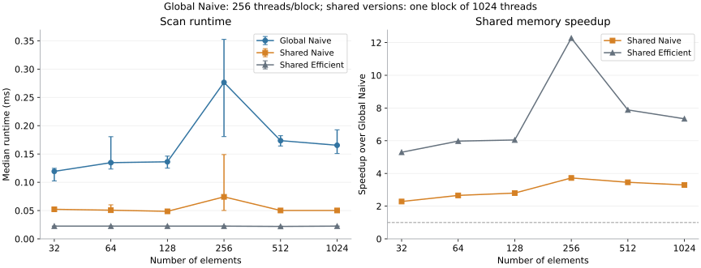

CUDA Stream Compaction
======================

**University of Pennsylvania, CIS 565: GPU Programming and Architecture, Project 2**

* Sizhe Liu
  * [LinkedIn](https://www.linkedin.com/in/sizhe-liu-2726492b6/), [Github](https://github.com/JamesLiu12).
* Tested on: Windows 11 Pro, i9-12900H @ 2.50GHz 32GB, RTX 3090 24GB (Personal Computer)
* CUDA 13.3; Visual Studio 2022; Release build.

## Overview

A CUDA implementation of exclusive scan and stream compaction, with radix sort as an extra feature. The project compares a serial CPU scan with three GPU versions to see how the amount of work and memory access pattern affect performance.

- **CPU:** a simple loop computes the running sum.
- **Naive:** each step adds values from an increasing offset, using two buffers to keep reads and writes separate. This takes $O(N \log N)$ work.
- **Work-Efficient:** an upsweep and downsweep compute the scan with $O(N)$ work. Inputs are padded to the next power of two when needed.
- **Thrust:** `thrust::exclusive_scan` serves as a library baseline.

Stream compaction removes zeroes while keeping the remaining values in order. The GPU version builds flags, scans them to find output positions, and scatters the retained values.

## Performance Analysis

Each configuration was tested 10 times in Release mode. Plots show median times, with error bars marking the middle 50% of results. CPU timing uses `std::chrono`; GPU timing uses CUDA events and excludes initial allocation and input/output transfers.

| Experiment | Variable | Fixed settings |
|---|---|---|
| Block size | 32, 64, 128, 256, 512, 1024 | N = $2^{10}$, $2^{16}$, $2^{22}$; Naive and Work-Efficient |
| Array size | $2^{10}$ to $2^{24}$, increasing by 4× | Naive block size 256; Work-Efficient block size 64; CPU and Thrust baselines |

### 1. Effect of Block Size


*Each panel uses a different vertical scale.*

The best block size changes with input size, and larger blocks are not always faster. At $2^{22}$ elements, Naive is fastest at 256 threads per block, while Work-Efficient is fastest at 64. These settings are used for the array-size comparison.

### 2. Effect of Array Size


*Both axes use a log scale.*

The CPU is much faster for small arrays. GPU times change relatively little at first, suggesting that launching kernels costs more than the small amount of work they perform. All three GPU versions first beat the CPU at $2^{22}$ among the tested sizes.

Work-Efficient is slower than Naive on small inputs despite doing less total work. Each tree level needs a separate kernel: at $2^{22}$ elements, it launches 43 kernels, compared with Naive's 23. The extra launches likely explain part of the difference. With larger arrays, the reduction in work becomes more useful, and Work-Efficient is about twice as fast as Naive at $2^{24}$.


*Speedup = CPU time / GPU time. Values above 1 mean the GPU version is faster.*

| Implementation | Time at $2^{24}$ (ms) | Speedup over CPU |
|---|---:|---:|
| CPU | 6.597 | 1.00× |
| Naive | 4.658 | 1.42× |
| Work-Efficient | 2.303 | 2.87× |
| Thrust | 0.847 | 7.79× |

Thrust performs best at large sizes. One noticeable result is its jump from about 0.127 ms at $2^{16}$ to 0.514 ms at $2^{18}$. A change in the library's execution strategy or setup cost could explain this, but the timing results alone do not show the cause.

### 3. Possible Bottlenecks

Nsight Systems helps show where time is spent between kernels, while Nsight Compute gives a closer look at one Naive scan step. These tests used $2^{24}$ elements and block size 128, which differs from the settings used in the performance graphs.

Naive seems to spend more effort moving data than doing calculations. Compute shows about 91.5% memory throughput but only 21–22% compute throughput for the tested kernel. This makes sense because every step reads and writes the whole array, even though each thread only performs a simple addition.

Work-Efficient cuts down the total work, but it still launches a separate kernel for every tree level. The Systems timeline shows noticeable gaps between these kernels. Near the root, some launches have only one block, so most of the GPU has no work to do. This helps explain why doing fewer additions does not always make it faster, especially for small arrays.

Thrust uses just two CUB kernels for this scan, compared with 25 for Naive and 47 for Work-Efficient. There is much less back-and-forth between kernel launches. Systems also shows temporary memory allocation and synchronization inside the Thrust call, so its total time includes more than just running the scan kernels.

## Extra Credit: Work-Efficient Scan

Each thread handles one active pair of tree nodes. At level `d`, only `N >> d` threads are needed, so the block count changes with each level. Extra threads return before computing their array indices. This avoids launching a full array of threads when most would have no work.

I also removed the separate root reset, `cudaMemset(dev_data + N - 1, 0, sizeof(int))`. The first downsweep uses zero as the root prefix directly. The final upsweep is skipped (`d < logn`) because it only computes the total sum that would be discarded. For `N > 1`, this saves one kernel launch and one memset; `N == 1` still needs a separate reset.

## Extra Credit: Shared Memory Scan

Both Naive and Work-Efficient scan also have a shared memory version. Each loads the input into shared memory, completes the scan inside one block, and writes the result back to global memory. `__syncthreads()` keeps threads synchronized between steps.



The comparison uses 32 to 1024 elements, with 10 runs per size and the same median and error bars as above. Global Naive uses block size 256; both shared versions launch one block of 1024 threads. Shared Naive supports up to 1024 elements and Shared Efficient up to 2048, so the graph stays within their common range.

| Implementation | Time at 1024 elements (ms) | Speedup over Global Naive |
|---|---:|---:|
| Global Naive | 0.1654 | 1.00× |
| Shared Naive | 0.0502 | 3.30× |
| Shared Efficient | 0.0225 | 7.34× |

Both shared versions are faster throughout this range. Keeping intermediate results in shared memory avoids repeated global memory reads and writes. They also finish in one kernel launch, which matters for these small arrays. The speedup includes both benefits.

Shared Efficient is fastest here. The shared versions use fixed-size buffers and scan loops, so smaller inputs do not reduce their work much. The spike at 256 elements also has wide error bars, making it a less reliable size-specific result. These single-block implementations would need an additional scan across blocks to handle larger arrays.

## Extra Credit: Radix Sort

The radix sort processes one bit at a time for 32 passes. Flipping the sign bit in the sorting key allows negative integers to be sorted correctly as well.

```cpp
StreamCompaction::Sort::radixSort(n, output, input);
```

For example, `[3, -2, 0, -7, 3]` becomes `[-7, -2, 0, 3, 3]`.

## Test Results

The tests cover power-of-two and non-power-of-two inputs, compaction, and radix sort with positive and negative integers.

<details>
<summary>Full test output: N = 2²², block size 64</summary>

```text
****************
** SCAN TESTS **
****************
    [   5  49  13  38  27  17  29  15  12  45  29   3  10 ...  10   0 ]
==== cpu scan, power-of-two ====
   elapsed time: 1.6859ms    (std::chrono Measured)
    [   0   5  54  67 105 132 149 178 193 205 250 279 282 ... 102726011 102726021 ]
==== cpu scan, non-power-of-two ====
   elapsed time: 1.7296ms    (std::chrono Measured)
    [   0   5  54  67 105 132 149 178 193 205 250 279 282 ... 102725971 102725989 ]
    passed
==== naive scan, power-of-two ====
   elapsed time: 1.35069ms    (CUDA Measured)
    passed
==== naive scan, non-power-of-two ====
   elapsed time: 1.25523ms    (CUDA Measured)
    passed
==== work-efficient scan, power-of-two ====
   elapsed time: 1.00592ms    (CUDA Measured)
    passed
==== work-efficient scan, non-power-of-two ====
   elapsed time: 0.911776ms    (CUDA Measured)
    passed
==== thrust scan, power-of-two ====
   elapsed time: 0.688128ms    (CUDA Measured)
    passed
==== thrust scan, non-power-of-two ====
   elapsed time: 0.861184ms    (CUDA Measured)
    passed

******************************
** SHARED MEMORY SCAN TESTS **
******************************
    [   5  49  13  38  27  17  29  15  12  45  29   3  10 ...  16   0 ]
==== cpu scan, power-of-two ====
   elapsed time: 0.001ms    (std::chrono Measured)
    [   0   5  54  67 105 132 149 178 193 205 250 279 282 ... 50196 50212 ]
==== cpu scan, non-power-of-two ====
   elapsed time: 0.0008ms    (std::chrono Measured)
    [   0   5  54  67 105 132 149 178 193 205 250 279 282 ... 50114 50157 ]
    passed
==== shared naive scan, power-of-two ====
   elapsed time: 0.080896ms    (CUDA Measured)
    passed
==== shared naive scan, non-power-of-two ====
   elapsed time: 0.014336ms    (CUDA Measured)
    passed
==== shared efficient scan, power-of-two ====
   elapsed time: 0.029696ms    (CUDA Measured)
    passed
==== shared efficient scan, non-power-of-two ====
   elapsed time: 0.017408ms    (CUDA Measured)
    passed

*****************************
** STREAM COMPACTION TESTS **
*****************************
    [   3   3   3   2   3   3   1   3   0   1   1   3   0 ...   0   0 ]
==== cpu compact without scan, power-of-two ====
   elapsed time: 9.0876ms    (std::chrono Measured)
    [   3   3   3   2   3   3   1   3   1   1   3   3   3 ...   2   2 ]
    passed
==== cpu compact without scan, non-power-of-two ====
   elapsed time: 9.9956ms    (std::chrono Measured)
    [   3   3   3   2   3   3   1   3   1   1   3   3   3 ...   2   2 ]
    passed
==== cpu compact with scan ====
   elapsed time: 13.4476ms    (std::chrono Measured)
    [   3   3   3   2   3   3   1   3   1   1   3   3   3 ...   2   2 ]
    passed
==== work-efficient compact, power-of-two ====
   elapsed time: 1.17206ms    (CUDA Measured)
    passed
==== work-efficient compact, non-power-of-two ====
   elapsed time: 1.00944ms    (CUDA Measured)
    passed

**********************
** RADIX SORT TESTS **
**********************
    [ -1851372651 1585168950 -1094099216 337292242 -1628411939 -110728936 1454986549 131017244 2145648761 -714912562 1104773626 -1253634976 -1051899939 ... -1954102413 -125548925 ]
==== cpu sort, power-of-two ====
   elapsed time: 313.724ms    (std::chrono Measured)
    [ -2147478322 -2147478085 -2147477500 -2147477071 -2147475620 -2147474653 -2147474159 -2147473968 -2147473771 -2147473070 -2147472318 -2147469191 -2147469127 ... 2147479232 2147482727 ]
==== radix sort, power-of-two ====
   elapsed time: 45.5165ms    (CUDA Measured)
    [ -2147478322 -2147478085 -2147477500 -2147477071 -2147475620 -2147474653 -2147474159 -2147473968 -2147473771 -2147473070 -2147472318 -2147469191 -2147469127 ... 2147479232 2147482727 ]
    passed
==== cpu sort, non-power-of-two ====
   elapsed time: 346.188ms    (std::chrono Measured)
    [ -2147478322 -2147478085 -2147477500 -2147477071 -2147475620 -2147474653 -2147474159 -2147473968 -2147473771 -2147473070 -2147472318 -2147469191 -2147469127 ... 2147479232 2147482727 ]
==== radix sort, non-power-of-two ====
   elapsed time: 48.2872ms    (CUDA Measured)
    [ -2147478322 -2147478085 -2147477500 -2147477071 -2147475620 -2147474653 -2147474159 -2147473968 -2147473771 -2147473070 -2147472318 -2147469191 -2147469127 ... 2147479232 2147482727 ]
    passed
```

</details>
